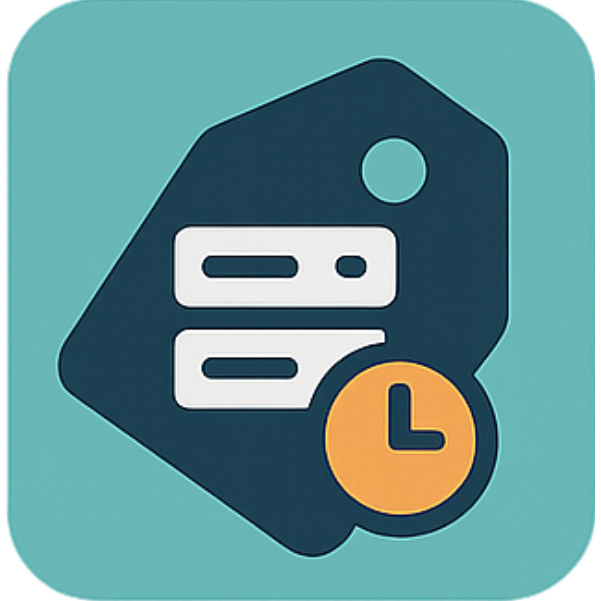
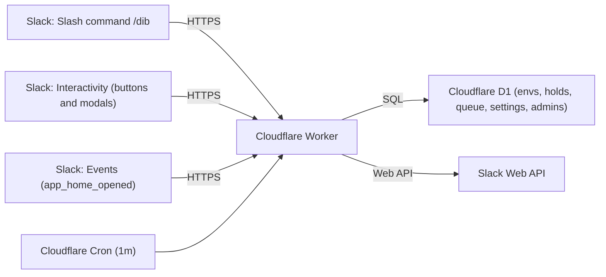
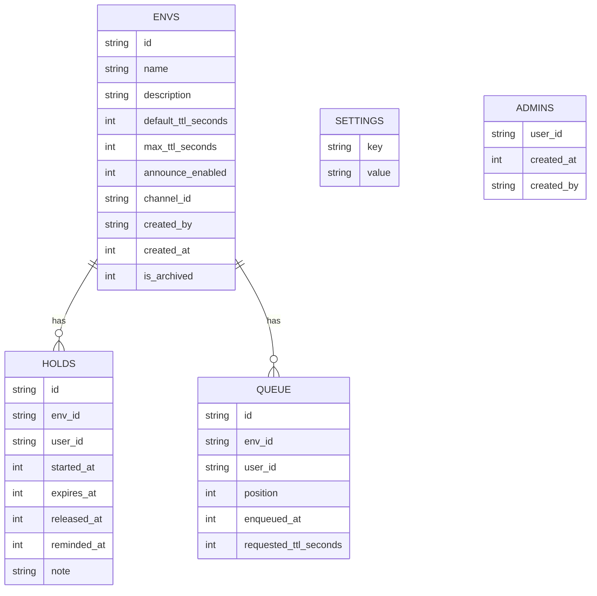

<p align="center">
  
</p>

# EnvDibs

> Dibs, not drama—for dev environments

<br clear="left"/>

<!-- Badges -->
<p align="center">
  <a href="LICENSE"></a>
  <a href="https://api.slack.com/apps"></a>
  <a href="https://developers.cloudflare.com/workers/"></a>
  <a href="https://www.typescriptlang.org/"></a>
  
</p>

## Table of Contents

<details>
  <summary>Click to expand</summary>

- [Overview](#overview)
- [Quick Start](#quick-start)
- [Architecture](#architecture)
- [Workspace scope (tenancy)](#workspace-scope-tenancy)
- [Data model](#data-model)
- [Features (all commands)](#features-all-commands)
- [App Home (Home tab)](#app-home-home-tab)
- [Interactivity (buttons & modals)](#interactivity-buttons--modals)
- [Announcements](#announcements)
- [Prerequisites](#prerequisites)
- [Deploy steps](#deploy-steps)
- [Local/remote dev notes](#localremote-dev-notes)
- [Testing (Automated)](#testing-automated)
- [Troubleshooting](#troubleshooting)

  - [Endpoints](#endpoints)
  - [Triggers](#triggers)
  - [Administration](#administration)
  - [Security & Privacy](#security--privacy)
  - [Repository structure](#repository-structure)
  - [Free-tier capacity estimate (as of 2025-09-11)](#free-tier-capacity-estimate-as-of-2025-09-11)
  - [License](#license)

</details>


## Overview

EnvDibs is a Slack slash-command app to manage dibs on shared development environments. It runs on Cloudflare Workers with D1 for storage and uses a cron trigger for auto-release and reminders.

## Quick Start

- Self-host this app: follow [Deploy steps](#deploy-steps) to create your Slack app, configure scopes/URLs, set secrets, provision D1, and deploy the Cloudflare Worker. Then install your app to your Slack workspace.
- In Slack, run `/dib help` to see commands.
- Create your first environment: `/dib add qa-msel default 60m`, then try `/dib on qa-msel for 30m`.

## Architecture



- The Worker verifies Slack signatures, acks quickly, and performs work via `waitUntil()` where possible.
- D1 stores environments, holds, queue entries, settings, and dynamic admins.
- Cron runs every minute for auto-release, reminders, and announcements.

## Workspace scope (tenancy)

- One deployment targets one Slack workspace (single-tenant).
- A deployment uses a single bot token and a single D1 database; data (envs, holds, queue, admins, settings) is shared within that deployment.
- To use EnvDibs in a second workspace, deploy a separate Worker + D1 (another instance of this repo).
- Multi-tenant mode (one deployment serving multiple workspaces) is not implemented yet.

## Data model

### ER diagram



<details>
  <summary><code>envs</code> — environments</summary>

| column | type | notes |
|---|---|---|
| id | TEXT | primary key |
| name | TEXT | unique, normalized |
| description | TEXT | optional |
| default_ttl_seconds | INTEGER | default 7200 |
| max_ttl_seconds | INTEGER | optional |
| announce_enabled | INTEGER | optional (0/1) |
| channel_id | TEXT | optional channel id (e.g., C123…) |
| created_by | TEXT | Slack user id |
| created_at | INTEGER | epoch seconds |
| is_archived | INTEGER | 0 or 1 |

Indexes/constraints: UNIQUE(name), idx_envs_name(name)

</details>

<details>
  <summary><code>holds</code> — active/past holds</summary>

| column | type | notes |
|---|---|---|
| id | TEXT | primary key |
| env_id | TEXT | FK → envs.id |
| user_id | TEXT | Slack user id |
| started_at | INTEGER | epoch seconds |
| expires_at | INTEGER | epoch seconds |
| released_at | INTEGER | nullable; null ⇒ active |
| reminded_at | INTEGER | nullable; last reminder time |
| note | TEXT | optional note from holder |

Indexes/constraints: idx_holds_active(env_id, released_at), partial UNIQUE uq_holds_one_active on env_id WHERE released_at IS NULL

</details>

<details>
  <summary><code>queue</code> — waitlist per env</summary>

| column | type | notes |
|---|---|---|
| id | TEXT | primary key |
| env_id | TEXT | FK → envs.id |
| user_id | TEXT | Slack user id |
| position | INTEGER | 1-based queue order per env |
| enqueued_at | INTEGER | epoch seconds |
| requested_ttl_seconds | INTEGER | optional request from user |

Indexes/constraints: UNIQUE(env_id, user_id), idx_queue_position(env_id, position)

</details>

<details>
  <summary><code>settings</code> — key/value</summary>

| column | type | notes |
|---|---|---|
| key | TEXT | primary key |
| value | TEXT | stringified value |

</details>

<details>
  <summary><code>admins</code> — dynamic admin list</summary>

| column | type | notes |
|---|---|---|
| user_id | TEXT | primary key (Slack user id) |
| created_at | INTEGER | epoch seconds |
| created_by | TEXT | who granted admin |

</details>

Notes:
- Active hold = row in `holds` with `released_at IS NULL`.
- Queue order is maintained by `position` per `env_id`.
- Global settings (DMs, reminders, log level) live in `settings`; per-env defaults and limits live in `envs`.

## Features (all commands)

| Command | Description |
|---|---|
| `/dib on <env> [for <duration>] [note <text>]` | Acquire a hold if free, or queue if busy. Examples: `for 2h`, `for 90m`, `note urgent fix`. |
| `/dib off <env>` | Release your hold. If you are queued, removes you from queue. |
| `/dib list [all|active|mine|free]` | Show environments: all (default), active, mine (your holds/queues), or free only. |
| `/dib add <env> [default <duration>] [desc <text>]` | Admin: create/unarchive environment and set default TTL/description. |
| `/dib extend <env> [for <duration>]` | Holder only: extend the current hold. If duration omitted, uses the global default extend value. Respects per-env max TTL; resets reminders. |
| `/dib info <env>` | Show details: holder, remaining, queue, default TTL, max TTL, description. |
| `/dib extend-default <duration>` | Admin: set the global default extend duration used by Home tab Extend and by `/dib extend` when no duration is provided. |
| `/dib set-default <env> <duration>` | Admin: set per-environment default TTL. |
| `/dib set-max <env> <duration|none>` | Admin: set per-environment max TTL (or `none` to remove the limit). |
| `/dib force-off <env>` | Admin: force release current hold and assign next in queue if any. |
| `/dib transfer <env> to <@user|U123>` | Admin: transfer the current hold to another user, preserving expiry. |
| `/dib archive <env>` | Admin: archive an environment (hidden from list; cannot be acquired). |
| `/dib unarchive <env>` | Admin: unarchive an environment. |
| `/dib rename <env> <new-name>` | Admin: rename environment (normalized; prevents collisions). |
| `/dib settings modal` | Admin: open a modal to manage global DMs/reminders/announcements/log level and per-env TTLs, rename, and announce channel. |
| `/dib admin <add|remove|list> [<@user|U123>]` | Admin: manage dynamic admins list. |
| `/dib dms <on|off>` | Admin: toggle global DMs (must be ON for reminder/expiry DMs to send). |
| `/dib dms reminder <on|off>` | Admin: toggle reminder DMs only. |
| `/dib dms expiry <on|off>` | Admin: toggle expiry DMs only. |
| `/dib settings` | Show current settings: DMs (global/reminder/expiry), reminder lead/min TTL, log level. |
| `/dib reminders <lead|min> <duration>` | Admin: configure reminder timing (lead window and minimum TTL required). |
| `/dib log <info|warning|error>` | Admin: set runtime log verbosity for cron and commands. |
| `/dib announce <on|off>` | Admin: toggle global announcements. |
| `/dib announce <env> <on|off>` | Admin: toggle per-environment announcements. |
| `/dib announce channel <env> <#channel|C123>` | Admin: set per-environment announcement channel. |

## App Home (Home tab)

- My Holds
  - See all your active holds with the "until" time.
  - Quick actions: Extend (uses global default, e.g., 15m), Release, Info.
  - Updates instantly after actions (we republish the Home view).
- My Queue
  - See queues you’re in with your position and ETA estimate.
  - Quick actions: Leave queue, Info.
- All Envs
  - Free: “Dibs on…” (opens modal for custom duration + note), Info.
  - Busy: “Join queue”, Info.

Header
- Refresh button to reload the Home tab view on demand.
- Shows the current global “Default extend” value.

Notes
- When you join a queue (or are already queued), the confirmation message includes an ETA estimate.

How to test App Home
- Enable Event Subscriptions (see Deploy steps above).
- Open the app in Slack → Home tab. This triggers `app_home_opened` and publishes the view.
- Try quick actions and observe the Home tab auto-refreshing.

## Interactivity (buttons & modals)

- App Home quick actions
  - Extend 15m, Release now, Info, Dibs on… (opens a modal for custom duration + note)
  - Home view updates immediately after actions (we republish the view)
- Message actions in channel announcements
  - Dibs on (default), Join queue, Release now, Info
- Dibs-on modal
  - Customize duration (e.g., 90m, 2h) and add an optional note
  - Uses Slack `views.open` + `views.publish`
- Interactivity endpoint
  - `POST /slack/interactive` — ack immediately; process in background

### Admin Settings modal

- Open via `/dib settings modal` (admin only); requires a Slack context (trigger_id)
- Global controls: DMs, reminder DMs, expiry DMs, announcements (global), reminder lead/min TTL, default extend, log level
- Per-env controls: default TTL, max TTL (or none), rename, per-env announcements on/off, announcement channel
- After apply, the app sends the admin a DM confirmation: “Applied admin settings.”

DM behavior (precedence)
- Global DMs act as a master switch. If Global DMs are OFF, reminder and expiry DMs will not be sent even if those per-feature toggles are ON.

## Announcements

- Global toggle: `/dib announce <on|off>`
- Per-environment toggle: `/dib announce <env> <on|off>`
- Set announcement channel: `/dib announce channel <env> <#channel|C123>`
- Announcements are posted when environments are assigned, released (free), or reassigned by force/off or expiry.

## Prerequisites

- Cloudflare account and Wrangler CLI
  - Install: `npm i -g wrangler` (or `npx wrangler --version` to use without global install)
  - Login: `wrangler login`
  - Verify your Cloudflare account email (required to use Workers)
- Slack workspace where you can create an app

## Deploy steps

1. Ensure cron triggers are present (already in `wrangler.toml`):
   ```toml
   [triggers]
   crons = ["* * * * *"]
   ```
2. Create and configure the Slack app
   - Go to https://api.slack.com/apps → Create New App (from scratch)
   - Basic Information → copy the Signing Secret
   - Slash Commands → Create `/dib`
     - Request URL: `https://<your-worker-subdomain>.workers.dev/slack/commands`
     - Short description: "Dibs, not drama—for dev environments"
     - Usage hint: "on|off|list|add|dms|reminders|log"
   - Interactivity & Shortcuts → enable Interactivity
     - Request URL: `https://<your-worker-subdomain>.workers.dev/slack/interactive`
     - Save changes
   - Event Subscriptions → enable
     - Request URL: `https://<your-worker-subdomain>.workers.dev/slack/events`
     - Subscribe to bot events:
       - `app_home_opened`
     - Save and re-install the app
   - OAuth & Permissions → Scopes:
     - Required: `commands`, `chat:write`, `im:write`, `users:read`, `views:write`
     - Required (for channel name fallback in `/dib announce channel`): `channels:read`, `groups:read`
     - Optional (future announcements): `chat:write.public`
   - Install App to Workspace
   - If you change Interactivity or Scopes later, re-install the app to apply changes
3. Configure Cloudflare Worker
   - Set secrets:
     - `wrangler secret put SLACK_SIGNING_SECRET` (from Slack > Basic Information)
     - `wrangler secret put SLACK_BOT_TOKEN` (from Slack > OAuth & Permissions)
   - (Optional) Restrict admin commands to specific users in `wrangler.toml`:
     ```toml
     [vars]
     ADMIN_USERS = "U12345,U67890"
     # Optional: auto-purge released holds older than N days
     RETENTION_DAYS = "90"
     ```
4. Setup D1 (database)
   - Create DB: `wrangler d1 create envdibs`
   - Bind in `wrangler.toml` (use the generated `database_id`)
   - Apply schema remotely: `wrangler d1 execute envdibs --remote --file ./schema.sql`
5. Deploy the Worker
   - `wrangler deploy`
   - Note the URL (use it as the Slash Command Request URL)

## Local/remote dev notes

- For a public URL usable by Slack during development, run: `wrangler dev --remote`
  - This executes your Worker on Cloudflare’s edge with a temporary *.workers.dev URL.
  - Use that URL in your Slack command configuration while testing.

## Testing (Automated)

We ship end-to-end tests using Vitest + Cloudflare Workers test pool.

- Requirements
  - Node.js 18+
  - Wrangler (already required above)
- Install dev deps
  - `npm install` (installs `vitest` and `@cloudflare/vitest-pool-workers`)
- Run tests
  - `npm test`

Notes
- Tests run the Worker in a simulated environment with:
  - `ALLOW_TEST = true`
  - `SLACK_API_BASE = http://test/__slack` (an in-Worker HTTP stub for Slack)
- Test-only endpoints:
  - `POST /test/reset` — recreate schema and wipe data
  - `POST /test/seed` — seed envs for a test run
  - `POST /test/command` — route a `/dib` text command without Slack signature
  - `POST /test/interactive` — route an interactive payload (no Slack verification)
  - `POST /test/cron` — run auto-release/reminder sweep immediately
  - `POST /test/slack/reset` — clear recorded Slack events
  - `GET  /test/slack/peek` — view recorded Slack DMs/messages/views
  - `POST /test/hold/expires` — set the active hold expiry (and optional started span)
  - `POST /test/apphome` — publish the App Home for a user
- Slack HTTP stub (Worker routes under `http://test/__slack`):
  - Endpoints: `chat.postMessage`, `views.publish`, `conversations.open`, `conversations.list`, `users.info`
  - Records to D1 table `test_slack_events`; retrieve via `/test/slack/peek`
- All of the above are ONLY enabled when `ALLOW_TEST` is set. They are not active in production.

## Endpoints

| Method | Path               | Purpose                                      |
|--------|--------------------|----------------------------------------------|
| POST   | /slack/commands    | Slash commands (/dib …)                      |
| POST   | /slack/events      | Events API (URL verification + ack)          |
| POST   | /slack/interactive | Interactive components (buttons/modals; ack then process) |

## Triggers

| Type | Schedule           | Purpose                           |
|------|--------------------|-----------------------------------|
| Cron | `* * * * *` (1m)   | Auto-release + DM reminders sweep |

## Administration

### Admin model

- Static admins: set a comma-separated list of Slack user IDs via either:
  - Wrangler Secret (recommended, keeps IDs out of git): `wrangler secret put ADMIN_USERS`
  - Or `wrangler.toml` `[vars].ADMIN_USERS` for non-sensitive IDs (committed to git)
- Dynamic admins: managed in the `admins` table via `/dib admin add|remove|list`.
- Slack workspace admins/owners: if available via `users.info` (requires `users:read`), they are treated as admins.

<details>
  <summary><strong>Bootstrap admin (no workspace admin required)</strong></summary>

If you are not a Slack workspace admin/owner and need to bootstrap the first admin for EnvDibs, use a one-time secret:

1. Get your Slack user ID (format: `U123...`)
   - In Slack → your profile → More (•••) → Copy member ID
2. Set the secret and deploy:
   ```bash
   wrangler secret put ADMIN_USERS
   # paste: U123ABC (or multiple: U123ABC,U456DEF)
   wrangler deploy
   ```
3. In Slack, promote others dynamically so you can remove the bootstrap secret later:
   - `/dib admin add @teammate`
   - `/dib admin list`
4. Optional cleanup (keep only dynamic admins):
   ```bash
   wrangler secret delete ADMIN_USERS
   wrangler deploy
   ```

</details>

## Security & Privacy

### Verification & transport

- All Slack requests are verified using `X-Slack-Signature` and `X-Slack-Request-Timestamp` (HMAC-SHA256 over the raw body with your Signing Secret). Requests older than 5 minutes are rejected.

### Authorization & admin guard

- Admin checks are layered. A user is considered admin if any is true:
  - Static allowlist via `ADMIN_USERS` (set as a secret or `[vars]` in `wrangler.toml`).
  - Dynamic admins table (`admins`) maintained via `/dib admin add|remove|list`.
  - Slack workspace `is_admin`/`is_owner` (if scope `users:read` is available).


### Least-privilege Slack scopes

- Required:
  - `commands` — receive `/dib` slash command.
  - `views:write` — open/update modals and publish App Home.
  - `chat:write` — send messages (announcements) to channels.
  - `im:write` — open IM and DM users for confirmations/reminders.
  - `users:read` — check `is_admin`/`is_owner` to complement the admin model.
- Conditional:
  - `channels:read`, `groups:read` — resolve channel names/IDs for per-env announcements.
  - `chat:write.public` — only if you want to post to public channels without inviting the bot first.

### Privacy

- We store minimal data to run the app:
  - Environment metadata (`envs`), holds/queue timing and user IDs (`holds`, `queue`), admin list (`admins`), key/value settings (`settings`).
  - Optional free-form note on holds if the user provides one.
- We do not store Slack message content or files.
- We only store Slack user IDs as identifiers; no emails or profile data.

### Data retention

- By default, operational data (envs, settings, holds, queue, admins) persists until you delete it.
- Optional automatic retention is supported:
  - Set a retention window with either `[vars].RETENTION_DAYS` in `wrangler.toml` or by writing a `retention_days` key into the `settings` table.
  - The 1‑minute cron sweep will purge holds with `released_at` older than the cutoff. Queue table only contains current entries; we do not keep queue history.
  - Keep auditability by exporting holds before purge if you need history.

Configuration examples

- `wrangler.toml`
  ```toml
  [vars]
  RETENTION_DAYS = "90"
  ```
- D1 SQL (remote)
  ```bash
  wrangler d1 execute envdibs --remote --command 'INSERT INTO settings(key, value) VALUES ("retention_days","90") ON CONFLICT(key) DO UPDATE SET value = excluded.value'
  ```

### Logging

- Logs avoid secrets and message bodies.
- We do not log raw Slack payloads or user‑entered text (e.g., slash command `text`); instead we log metadata only (e.g., `arg_count`, `text_len`, endpoint) plus structured fields like `action`, `user_id`, `env`, `result` for observability.

## Repository structure

- `wrangler.toml` — Worker config (points to `src/worker.ts`)
- `schema.sql` — Database schema
- `tsconfig.json` — TypeScript config
- `src/worker.ts` — Worker entry (TypeScript)
- `src/types.ts` — Env and D1 types
- `src/slack/verify.ts` — Slack signature verification
- `src/slack/respond.ts` — JSON response helpers
- `src/slack/format.ts` — Slack date formatting and humanizing durations
- `src/util/ids.ts` — UUID helper
- `src/util/names.ts` — Environment name normalization
- `src/util/durations.ts` — Duration parsing
- `src/services/db.ts` — Transaction helper
- `src/services/envs.ts` — Environment CRUD (add/get and admin helpers)
- `src/services/dibs.ts` — Dibs logic (on/off/list)
- `src/commands/router.ts` — Slash command routing
- `src/interactive/router.ts` — Interactive actions + modal submissions
- `src/slack/blocks.ts` — Block Kit element helpers
- `src/slack/blocks/announce.ts` — Announcement message blocks with action buttons
- `src/slack/modals/dibs_on.ts` — Dibs-on modal builder (duration + note)

## Free-tier capacity estimate (as of 2025-09-11)

These are conservative, non-binding estimates to help you plan. Cloudflare changes quotas periodically; always verify in your dashboard and the official pricing pages.

- Workers (Free)
  - Requests per day: approximately 100,000 requests/day (per account across Workers).
  - Short CPU time budget per request (sufficient for this app’s simple handlers; avoid long-running work in request path).

- D1 (Free)
  - Ballpark monthly allowances (as last verified in public docs circa 2024):
    - Reads: ~5,000,000 row reads/month → ~166,666/day
    - Writes: ~50,000 row writes/month → ~1,666/day
    - Storage: ~1 GB included (per database)
  - Your effective daily request capacity is the minimum of Workers’ request cap and D1 operation caps divided by per-request DB usage.

- What this means for EnvDibs (rough planning)
  - Read‑heavy flows (e.g., `/dib list`, `/dib info`, App Home publish): ~3 reads per request ⇒ ~55k req/day before hitting D1 read cap.
  - Write‑heavy flows (e.g., `/dib on|off|extend`, queue changes): ~2 writes + ~5 reads per request ⇒ ~833 req/day before hitting D1 write cap.
  - Mixed usage: capacity will sit between those two, and never exceed Workers’ ~100k req/day.

- How to check your actual usage & limits
  - Cloudflare Dashboard → Workers → your Worker → Analytics (requests)
  - Cloudflare Dashboard → D1 → your database → Analytics (reads/writes)
  - Consider alerting in your observability tool when you approach either cap (Workers requests or D1 writes/reads).

## License

MIT — see [LICENSE](LICENSE)
